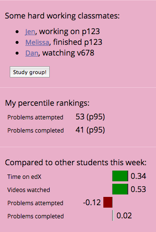

# mobile-learning-experience
Hacking on an EdX challenge (http://databits.io/challenges/edx-learning-dashboard-challenge)

## Overview
This is primary focused on the student learning experience, with only the initial steps of a teacher experience.  So it's mostly trying to get at things like:

For the teacher experience, I only started, but was focused on giving the teacher the sense of the classroom's disposition and progress, and helping them identify places where their intervention could have the most impact.

There's some notes in comments within the code as well.  I had hoped to make more progress and also package this up a bit more nicely, but didn't get to it.  Hopefully there's some little bits of usefulness in here as is anyway.  :)

Here we go!

### Student experience
This is the primary screen.  Here you can see a silly  image, where we're trying to give the student an especially powerful nudge to take action, since we can see they're so close to completing a section and only have one problem left.

The idea is that the top 'card,' and most salient place in the UI, is used whenever we see an opportunity to intervene in a way that can help the student.  I'll show some other examples shortly, but let's look at the rest of the UI first to get a feel for it.

The next thing we want to do is help the student feel progress when they're making it, and let them see their current work rhythm:

The first card is just showing progress, and we could probably be more opinionated in the display here and choose one main metric to track.  The second card has a slight bit of educational paternalism with the framing, where we want them to be explicitly aware of how steady vs. bursty their learning behaviors are.

Finally, there's a few cards that are trying to put the student in the context of a classroom.  It provides a call-to-action to collaborate and work together with other students, and then some comparisons with other students that might appeal to more competitive courses or students.  If the online course had chat or forums or other parts as a first-class part of the course, this is where those integrations would be.

That's the walkthrough.  Here are a few more primary nudges that might show up as the first card in the UI during moments where we think a nudge can have an impact on student behavior.  There are details here about how often to show these to students, but hopefully it's fairly clear how we could compute the opportune times to show these based on the EdX dataset.

### Teacher experience
First, we want to give the teacher a sense of the overall calibration of the course and the enrolled students.  In this dataset, the all-time engagement percentage seems an important top-line metric so that's up front:

Right below that I started sketching out the next level.  This is very rough, but the idea is to show some information about the distribution of students in the class, what they're doing and how they're progressing.  The most interesting bits that I'd shape into the next iteration here was the distribution in the number of problems completed, and then some relationship between the distribution for problems attempted vs. the distribution of problems completed.  This just calls out the distribution of problems completed:

Next, there's some information about students.  This probably makes sense to split up a bit more based on how the teacher can help.  Perhaps top performing students that the teacher could ask to serve as tutors or help in online forums, and the most engaged but lowest performing students, since teacher intervention there may have the most impact.  I didn't think this through as much.

In the current iteration, this is just a list, sorted by the number of problems completed.  I also attached some names to the EdX dataset to make it feel a little more real.  The teacher can click on the student's name, and go to their page and see what their experience is, or get a more in-depth picture of how that individual student is doing and how they compare to peers, in the same way that student does.

### Conclusion
That's all!  This was a fun project to work on, even if I didn't get to spend enough time and make as much progress as I'd hoped.  I hope you all can find some useful bits in here, and please feel free to reach out if there's anything else I can better explain or help with.

-Kevin

## Technical notes
This was developed towards an iPhone 5 on mobile web.  You can simulate this in Chrome web inspector tools.

It's a mixture of offline processing of the data in `edx-dataset` using code in the `scripts` folder, some server computations in `server.coffee` and some in-browser computation as well.  The entry point for the server is `server.coffee` and the entry point for the browser app is the static `index.html` that runs `src/main.coffee`.

### Run and develop locally
`npm install`

Terminal 1:
`npm run-script build` # long-running process to watch and build

Terminal 2:
`npm start` # runs web server

In the browser:
`http://localhost:3004/`